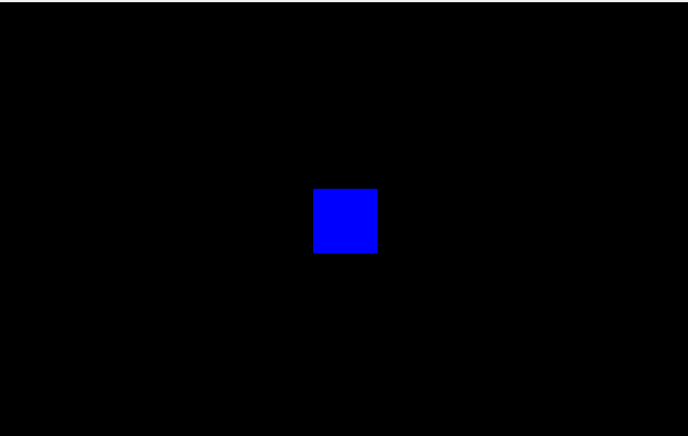
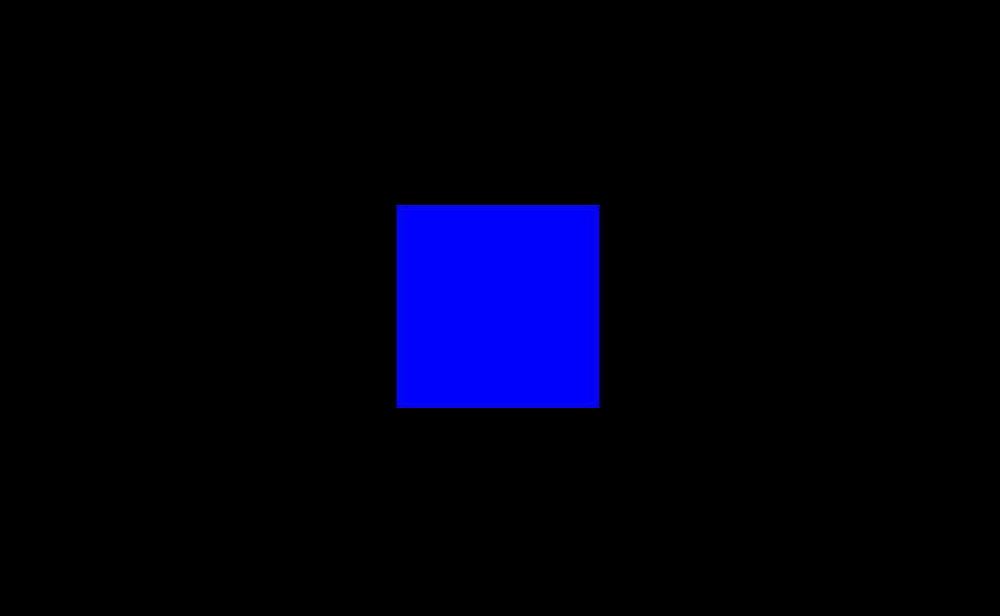
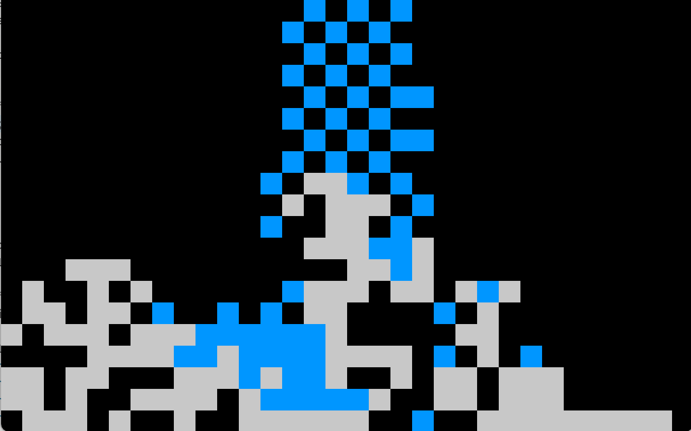
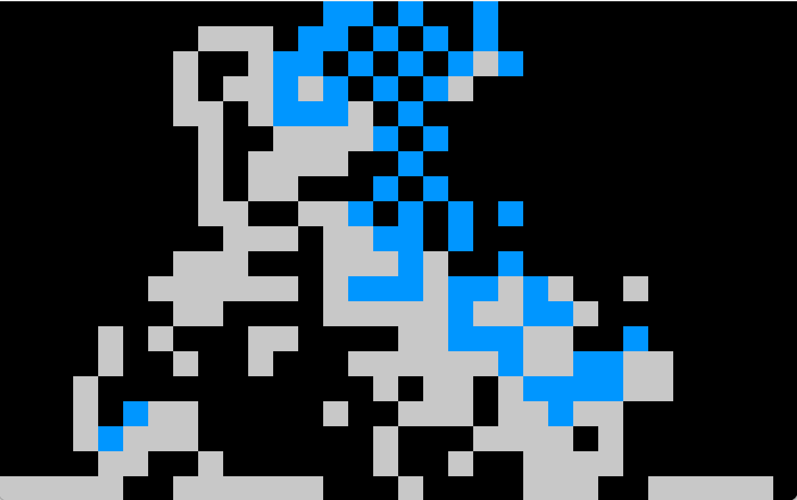

# Automate Cellulaire JOUR 2

## Projet

J'ai choisi d'utiliser Processing pour cette semaine. Pour accéder au rendu, il suffit de l'installer et d'ouvrir le fichier `.pde` dedans.

## Exploration (BONUS)

Pour débuter, j’ai créé, à l’aide d’un automate cellulaire, une forme de “respiration” : une phase d’augmentation des cellules vivantes suivie d’une phase d’augmentation des cellules mortes. Ce premier projet, réalisé en m’appuyant sur des exemples de code et quelques recherches, m’a permis de me familiariser avec le concept.

## Mon projet

Pour ce deuxième jour, j’ai décidé d’explorer les automates cellulaires à travers la simulation de l’écoulement d’un fluide au sein d'une grille.
J’ai commencé par générer aléatoirement des cases représentant des blocs.
Ensuite, grâce à un petit automate cellulaire, ces blocs s’étendent pour former des plateformes de tailles diverses.
À partir de cette base, j’ai ajouté une chute d’eau composée de cellules bleues.
Ces cellules se déplacent selon un ensemble de règles simples :

- l’eau tombe si l’espace en dessous est vide
- elle s’accumule si elle rencontre d’autres cellules d’eau
- elle glisse latéralement lorsqu’elle est bloquée par un bloc
- elle remplit naturellement les creux.

## Crédits

Chloé CHABAUD - IMAC E3  
ChatGPT - pour aide au débuggage (notamment pour gérer les conditions de l'écoulement de l'eau)
