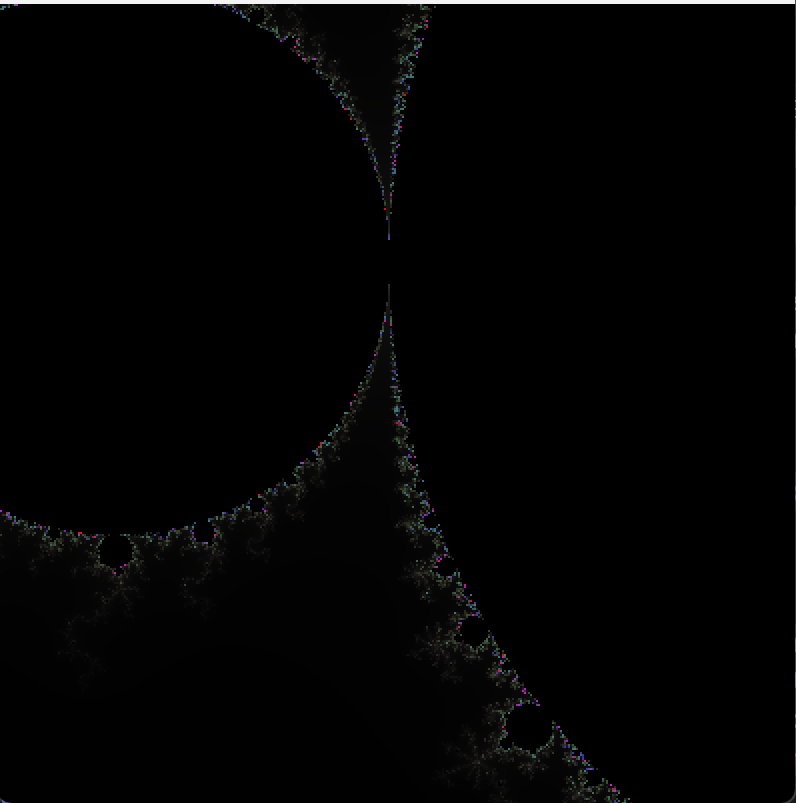
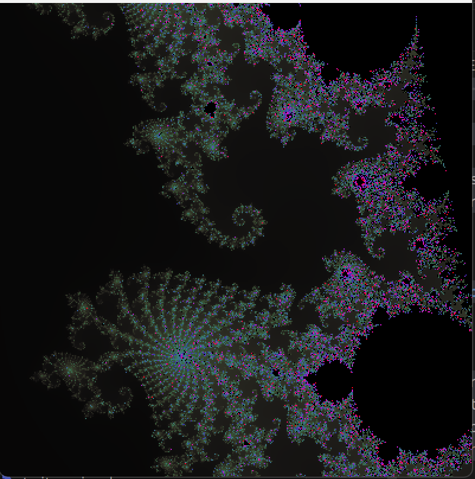
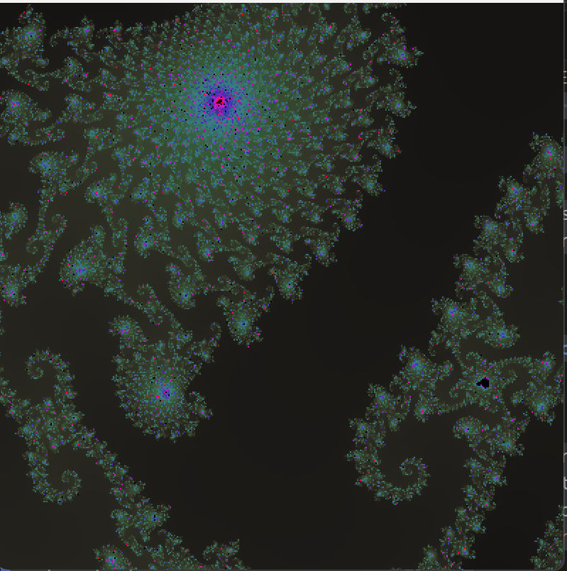

# Fractal JOUR 3

## Projet

J'ai choisi d'utiliser Processing pour cette semaine. Pour accéder au rendu, il suffit de l'installer et d'ouvrir le fichier `.pde` dedans.

## Mon projet

Pour ce troisème jour, j’ai recodé une fractal selon le modèle de Mandelbrot. En mathématiques, l'ensemble de Mandelbrot est une fractale définie comme l'ensemble des points c du plan complexe pour lesquels la suite de nombres complexes définie par récurrence par :
z[n+1]=z[n]^2+c est bornée.

J’ai ensuite ajouté des couleurs à ces points, en fonction de la vitesse de divergence (le nombre d’itérations avant que la suite ne diverge).
Puis j’ai intégré un effet de zoom, dont l’intensité varie au cours du temps, afin de rendre l’œuvre dynamique et de mettre en valeur la répétition et la richesse esthétique du motif.

## Crédits

Chloé CHABAUD - IMAC E3  
ChatGPT - pour aide au débogage et aide pour les calculs permettant la dynamisation.
