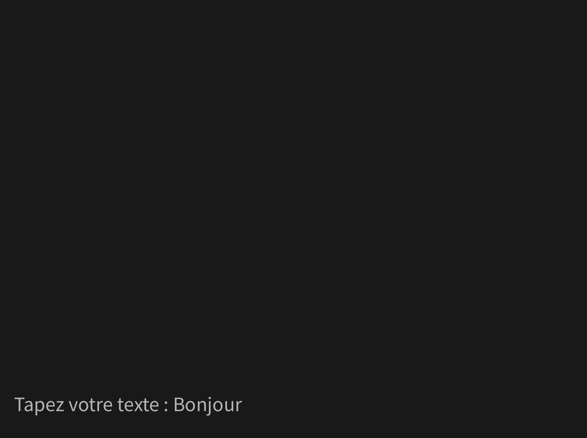
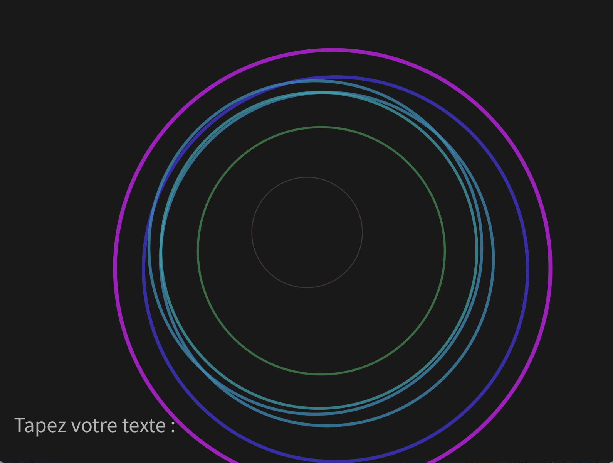

# Fractal JOUR 3

## Projet

J'ai choisi d'utiliser Processing pour cette semaine. Pour accéder au rendu, il suffit de l'installer et d'ouvrir le fichier `.pde` dedans.

## Exploration (BONUS)

Pour débuter, j’ai recodé l'algorithme de Strachey qui génère un poème d'amour de manière aléatoire

## Mon projet

Pour mon projet personnel, j’ai voulu, à partir de phrases et de mots, créer une œuvre en mouvement. Pour cela, de manière algorithmique, j’ai transformé chaque lettre en une ellipse avec des paramètres qui lui sont propres, et qui apparaissent et bougent en fonction de la lettre choisie.
Cela permet de donner vie aux mots.
J’ai rendu l’ensemble interactif en permettant à l’utilisateur de saisir la phrase qu’il souhaite. Il voit alors défiler un ensemble d’ellipses de tailles et de couleurs différentes, générées à partir de chaque lettre. Chaque phrase devient ainsi une œuvre unique, toujours différente des précédentes.

## Crédits

Chloé CHABAUD - IMAC E3  
ChatGPT - pour aide au débuggage et aide pour les calculs mathématique pour créer l'ellipse.
