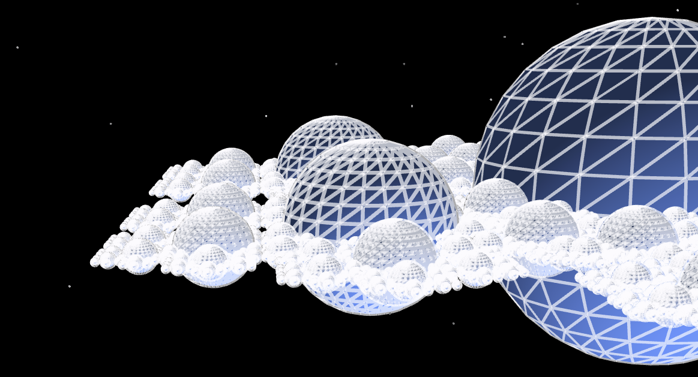
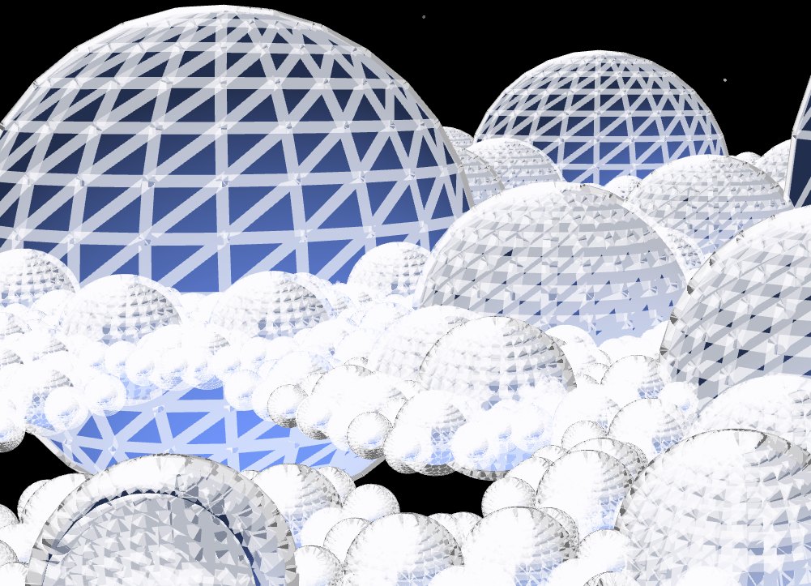

# Fractal JOUR 3

## Projet

J'ai choisi d'utiliser Processing pour cette semaine ainsi que p5.js pour ce derneir jour.

## Mon projet

J’ai voulu améliorer mon œuvre de poésie algorithmique en y ajoutant un élément sonore. Malheureusement, je n’y suis pas parvenue. Je souhaitais que chaque lettre soit associée à une note. Après cet échec, j’ai tenté de faire varier la fréquence du son en fonction des lettres, mais même après plusieurs échanges avec mes camarades, je n’ai pas réussi à faire fonctionner cette idée avec mon code précédent.
Pour ce dernier jour, j’ai donc décidé d’expérimenter la 3D avec p5.js. J’ai ainsi créé une fractale en 3D sous la forme de six planètes en orbite autour d’une autre planète, elle-même entourée de six autres, et ainsi de suite.
Pour être honnête, cette fin de projet n’est pas à la hauteur de mes espérances ni du temps que j’y ai consacré. Cependant, j’ai passé beaucoup de temps à expérimenter, à rechercher des outils, à essayer de les comprendre, et à échanger avec mes camarades plus à l’aise que moi. C’est ce qui me permet, malgré tout, de trouver ce projet gratifiant.

## Crédits

Chloé CHABAUD - IMAC E3  
ChatGPT - ChatGPT m’a aidée pour le débogage du projet final et pour l’ajout de l’audio dans le projet de base. J’ai donc choisi de ne pas intégrer cette partie (première idée) dans mon rendu final, car je l'ai jugé impertinente dû à l'utilisation forte de l'IA fâce à la difficulté .
