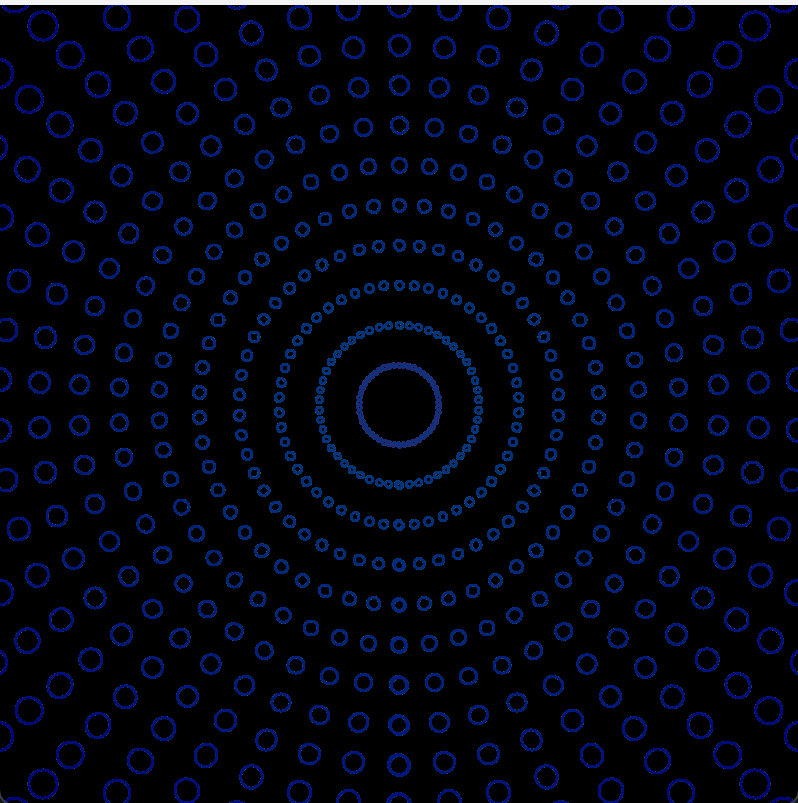
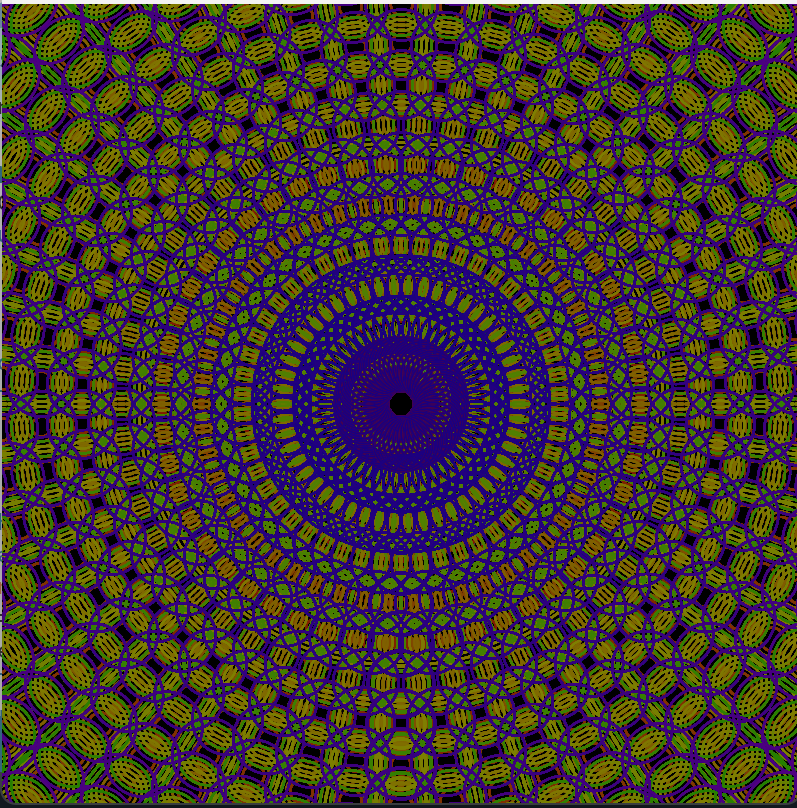

# Dessin Algorithmique JOUR 1

## Projet

J'ai choisi d'utiliser Processing pour cette semaine. Pour accéder au rendu, il suffit de l'installer et d'ouvrir le fichier `.pde` dedans.

## Les exemples

Pour les exemples, j'ai transcrit le code fourni en Java. Je me suis aidée de l'IA pour comprendre le code donné, notamment les notations que je ne connaissais pas. Pour les commandes Java que je ne connaissais pas, je me suis aidée d'exemples trouvés sur p5.js.

Pour l'ajout de couleur, j'ai décidé d'en ajouter **aléatoirement et de manière différente** à chaque rectangle, et à chaque entrée dans la boucle `draw`.

## Mon projet

    Pour ce premier jour, je voulais travailler avec des cercles et les rotations possibles du plan. J'ai ensuite cherché à rendre mon œuvre interactive, d'où l'ajout de la fonctionnalité `mouseClicked()`, qui ajoute des cercles de couleurs différentes, sans effacer les précédents. Enfin, j'ai ajouté un changement de couleur pour le côté esthétique.

## Crédits

Chloé CHABAUD - IMAC E3  
ChatGPT - pour la gestion des couleurs
